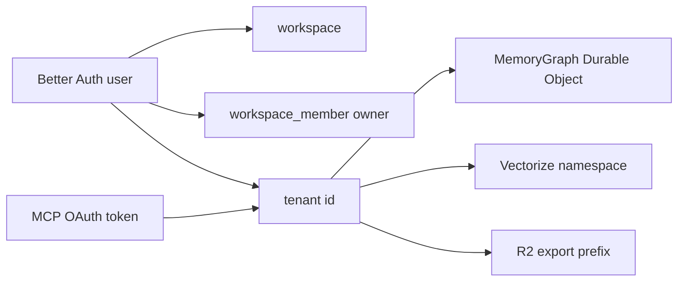
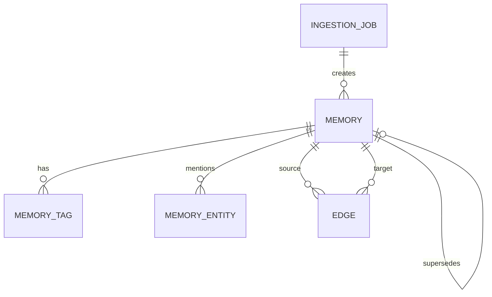
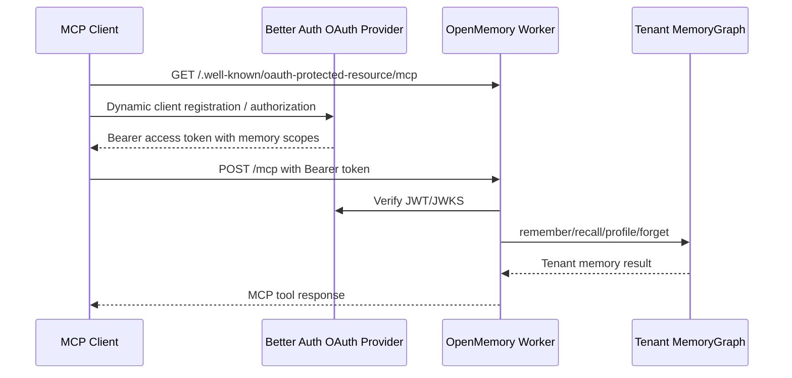

# OpenMemory Data Model

This document describes the launch-time data shape across the Cloudflare-native
stack. Every table, object, binding, and relationship here maps back to current
code.

## Tenant Boundary

OpenMemory stores product memory by tenant. In local development, the tenant is
resolved from `x-openmemory-user-id`. In hosted production, tenant identity is
session/OAuth-backed and header tenant mode is rejected outside localhost.



The effective tenant id is normalized before it is used as the Durable Object
name. That keeps casing differences from creating separate graph partitions.

## D1 Control Plane

Drizzle defines the D1 schema in `apps/api/src/db/schema.ts` and migrations live
in `apps/api/drizzle/`.

| Table | Purpose | Important relationships |
| --- | --- | --- |
| `user` | Better Auth user profile and identity root. | Owns `session`, `account`, `workspace`, and OAuth grants. |
| `session` | Better Auth session cookie records. | `session.user_id -> user.id`. |
| `account` | Better Auth provider/account credentials. | `account.user_id -> user.id`. |
| `verification` | Better Auth verification state. | Independent auth support table. |
| `jwks` | OAuth/JWT signing keys used by Better Auth OAuth Provider. | Read by MCP bearer verification. |
| `oauth_client` | Dynamic OAuth client registrations for MCP and other clients. | Optional `user_id -> user.id`; revoked by client id. |
| `oauth_access_token` | Issued OAuth access tokens. | Carries user/client/session references and scopes. |
| `oauth_refresh_token` | Issued refresh tokens and revocation state. | `user_id` is required. |
| `oauth_consent` | User consent records for OAuth clients/scopes. | `client_id` plus `user_id`. |
| `workspace` | Session-backed workspace/control-plane tenant. | `owner_user_id -> user.id`. |
| `workspace_member` | Owner/admin/member rows and invites. | `workspace_id -> workspace.id`, optional `user_id -> user.id`. |

The product graph is not stored in D1. D1 is the auth/control-plane database;
Durable Objects hold tenant graph state.

## Durable Object Memory Graph

Each tenant maps to one `MemoryGraph` Durable Object in
`apps/api/src/memory-graph.ts`. The object uses SQLite-backed Durable Object
storage.

| Entity | Shape | Notes |
| --- | --- | --- |
| Memory | `id`, `content`, `tags`, `metadata`, `type`, `confidence`, `importance`, `status`, `isLatest`, `supersedesId`, `entityIds`, timestamps. | Active memories are default recall candidates. Superseded/forgotten rows remain available for historical/export paths. |
| Edge | `sourceId`, `targetId`, `relationship`, `weight`, `metadata`, timestamps. | Relationship values come from the canonical taxonomy in `packages/core/src/index.ts`. |
| Memory tag | `memory_id`, `tag`. | Used for filtering and dashboard stats. |
| Memory entity | `memory_id`, `entity_id`. | Used for deterministic graph expansion and related-memory links. |
| Ingestion job | `sourceId`, `status`, `input`, `metadata`, `result`, timestamps. | Async source ingestion state for Queue/Workflow processing. |
| Profile summary | Derived from current profile/preference/fact memories. | Returned by `/v1/profile` and MCP `profile`. |



## Relationship Taxonomy

The canonical graph relationship catalog is exported from
`packages/core/src/index.ts` and served through `/v1/graph/relationships`.

| Relationship | Category | Direction | Default weight | Meaning |
| --- | --- | --- | --- | --- |
| `updates` | temporal | reverse | 0.95 | Newer memory updates an older memory. |
| `extends` | temporal | forward | 0.82 | Newer memory adds detail without replacing the old one. |
| `derives` | provenance | forward | 0.78 | Memory was derived from another memory/source. |
| `supports` | causal | forward | 0.72 | Source strengthens the target. |
| `blocks` | causal | forward | 0.7 | Source prevents or conflicts with the target. |
| `depends_on` | causal | forward | 0.76 | Source requires target context. |
| `replaces` | temporal | reverse | 0.9 | Source supersedes the target. |
| `uses` | provenance | forward | 0.64 | Source references or uses target material. |
| `improves` | causal | forward | 0.68 | Source improves the target. |
| `shares_entity` | semantic | bidirectional | 0.46 | Memories mention the same extracted entity. |
| `next_chunk` | sequence | forward | 0.52 | Source chunk adjacency. |
| `previous_chunk` | sequence | reverse | 0.52 | Reverse source chunk adjacency. |

Edge writes validate against this taxonomy at the HTTP boundary and again in the
Durable Object.

## Embeddings and Vectorize

When `AI` and `MEMORY_VECTORS` are configured, `apps/api/src/semantic-index.ts`
creates embeddings with the configured `EMBEDDING_MODEL` and writes vectors to
Vectorize. Vector ids are tenant-scoped so one tenant cannot retrieve another
tenant's vectors.

The search path uses semantic candidates when available and falls back to
deterministic keyword/graph ranking when embeddings are not configured.

## R2 Exports

`POST /v1/exports` serializes the current tenant graph and writes JSON to R2
when `MEMORY_EXPORTS` is bound.

Export keys use:

```txt
<tenant-id>/exports/<timestamp>.json
```

The export payload contains `version`, `exportedAt`, graph `stats`, `memories`,
and `edges`.

## Tenant Purge

`DELETE /v1/tenant` hard-deletes the resolved tenant's Durable Object graph data
after the caller supplies a matching `confirmTenantId`. The operation removes
memories, edges, memory tags, memory entities, and ingestion jobs from the
tenant Durable Object. It also best-effort deletes matching Vectorize ids using
the `<tenant-id>:<memory-id>` vector id convention.

`DELETE /v1/account` is the session-backed account deletion path. It requires
matching `confirmEmail` and `confirmTenantId`, purges the tenant graph first,
best-effort deletes Vectorize ids, then deletes user-owned D1 control-plane
rows for OAuth grants, sessions, auth accounts, owned workspaces, workspace
memberships, and the user record.

R2 export objects are not deleted by either purge path. Operators should apply
the configured R2 lifecycle policy or manually remove export objects when a
stricter deletion request requires it.

## Queues and Workflows

| Binding | Message | Consumer |
| --- | --- | --- |
| `SOURCE_INGESTION_QUEUE` | `SourceIngestionMessage` with `sourceId`, `tenantId`, input, and request timestamp. | Starts `SOURCE_INGESTION_WORKFLOW` when configured, otherwise processes inline. |
| `MEMORY_EXTRACTION_QUEUE` | `MemoryExtractionMessage` with `memoryId`, `tenantId`, and reason. | Starts `MEMORY_EXTRACTION_WORKFLOW` when configured, otherwise processes inline. |

Both consumers retry failed messages and write structured error telemetry.

## OAuth and MCP

Better Auth OAuth Provider owns discovery, dynamic client registration, consent,
token issuance, JWKS, and bearer verification.



MCP tools at launch are `remember`, `recall`, `profile`, and `forget`.

## Readiness Snapshot

`GET /v1/readiness` returns a safe operational summary for the resolved tenant:

- tenant source and normalized tenant id
- graph counts, density, entity count, tag count
- relationship catalog size and top relationship distribution
- binding availability booleans
- auth mode and provider availability booleans
- MCP endpoint and metadata URLs
- rate-limit status
- warning codes for incomplete optional production bindings

The endpoint does not expose secrets, raw tokens, private keys, full memory
contents, or cross-tenant state.
