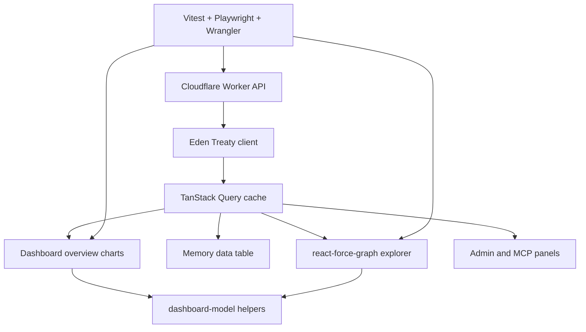

# feat: OpenMemory polish readiness

## Summary

This plan closes the remaining polish gap between the current OpenMemory alpha and a cleaner, documented, testable control plane. It focuses on the hosted TanStack Start dashboard, graph explorer usability, MCP/admin surfaces, docs, and verification coverage without changing the Cloudflare-native backend architecture.

---

## Problem Frame

OpenMemory already has a functional Worker API, Durable Object graph store, Better Auth/OAuth foundation, MCP endpoint, TanStack Start UI, charts, and a library-backed graph explorer. The remaining risk is product readiness: the UI still needs a more cohesive dashboard shape, the graph explorer needs stronger inspection ergonomics, docs need to match the current implementation, and tests should prove the critical browser workflows that users will trust before self-hosting or connecting MCP clients.

---

## Requirements

- R1. The dashboard presents memory health, lifecycle/indexing state, graph health, and MCP/account status in a cohesive shadcn-style control-plane layout.
- R2. The knowledge graph explorer supports useful inspection of selected nodes, relationships, neighbors, and filters without hidden state or non-shareable controls.
- R3. Admin and MCP views expose the current auth and client-connection state clearly enough for a self-hosting operator to configure and debug access.
- R4. Documentation reflects the current monolithic Cloudflare Worker deployment, MCP surface, test commands, local limitations, and roadmap status.
- R5. Static, unit, integration, and browser tests cover the polished workflows without relying on default ports or unstated remote Cloudflare bindings.
- R6. Code remains cleanly typed, scoped, and consistent with existing TanStack, shadcn-style UI, Recharts, Eden Treaty client, and Wrangler test patterns.

---

## Key Technical Decisions

- **Keep the monolithic Worker deployment:** The current docs and deployment plan already choose one Worker for API, web UI, auth, and MCP until session-specific MCP state or separate scaling justifies a split.
- **Use existing TanStack and shadcn-style primitives:** The UI should continue to build from `packages/ui`, TanStack Query/Router, Recharts, and the current CSS tokens rather than introducing another design system.
- **Treat the graph explorer as the primary visual anchor:** `react-force-graph-2d` is already installed and covered by browser tests, so hardening its controls and inspector is higher value than another library migration now.
- **Prefer model helpers for dashboard analytics:** New charts should derive from pure helpers in `apps/web/src/dashboard-model.ts` so they are unit-testable and easy to reuse.
- **Keep remote-provider behavior opt-in:** Workers AI, Vectorize, and live OAuth/MCP checks stay in explicit live suites because local Wrangler does not fully emulate those bindings.

---

## High-Level Technical Design

---

## Implementation Units

### U1. Dashboard Completion Audit And Status Cleanup

- **Goal:** Align roadmap, README status, and visible dashboard terminology with the current implemented state.
- **Requirements:** R1, R4, R6.
- **Dependencies:** None.
- **Files:** `README.md`, `docs/roadmap.md`, `docs/deployment.md`, `docs/mcp.md`.
- **Approach:** Audit current code and tests against the docs. Update only claims that are stale or materially incomplete, and preserve alpha caveats where live provider validation is still opt-in.
- **Patterns to follow:** Existing README status blocks, `docs/roadmap.md` current baseline and next-track sections, `docs/deployment.md` monolithic Worker deployment notes.
- **Test scenarios:** Test expectation: none -- documentation-only changes should be verified by markdown review and existing link/path consistency.
- **Verification:** A reader can identify what works now, what is opt-in/live-only, and what remains on the roadmap without conflicting statements across docs.

### U2. Dashboard Analytics Polish

- **Goal:** Add or refine dashboard panels that prove recall quality, memory growth, lifecycle freshness, indexing health, and MCP usage at a glance.
- **Requirements:** R1, R5, R6.
- **Dependencies:** U1 for terminology alignment.
- **Files:** `apps/web/src/dashboard-model.ts`, `apps/web/src/dashboard-model.test.ts`, `apps/web/src/routes/index.tsx`, `apps/web/src/styles/app.css`, `apps/web/e2e/dashboard.spec.ts`.
- **Approach:** Extend pure dashboard model helpers before rendering new panels. Keep Recharts usage consistent with the existing cadence, type, and lifecycle panels, and keep all chart labels accessible.
- **Execution note:** Add model tests before wiring chart UI when introducing new derived metrics.
- **Patterns to follow:** `getActivitySummary`, `getTypeDistributionSummary`, `getGraphHealthSummary`, `DashboardOverview`, and existing `.chart-panel` styles.
- **Test scenarios:** 
  - Given memories with mixed current and historical state, the model reports expected freshness or index-health percentages.
  - Given seeded dashboard data, Playwright sees the new chart panel, accessible label, and summary text.
  - Given an empty memory set, chart helpers return stable zero-state summaries without NaN or broken labels.
- **Verification:** `bun run check`, `bun run test:e2e:local`, and a screenshot of the dashboard show the new analytics without layout overlap.

### U3. Knowledge Graph Explorer Hardening

- **Goal:** Make the graph explorer more useful for inspection by tightening filters, selected-node context, relationship summaries, and responsive layout behavior.
- **Requirements:** R2, R5, R6.
- **Dependencies:** U2 for shared dashboard-model patterns.
- **Files:** `apps/web/src/dashboard-model.ts`, `apps/web/src/dashboard-model.test.ts`, `apps/web/src/dashboard-components.tsx`, `apps/web/src/routes/index.tsx`, `apps/web/src/styles/app.css`, `apps/web/e2e/dashboard.spec.ts`.
- **Approach:** Keep graph state URL-backed where user-visible, keep graph derivation in model helpers, and avoid custom graph physics beyond stable layout constraints needed for readability.
- **Patterns to follow:** Existing `KnowledgeMap`, `GraphExplorerControls`, `getKnowledgeMap`, relationship filter tests, and Playwright graph assertions.
- **Test scenarios:**
  - Given a selected memory with explicit edges, the inspector lists incoming/outgoing relationships and neighbor summaries.
  - Given relationship/type/search filters in the URL, the graph controls hydrate to those values and the visible relationship list reflects them.
  - Given a narrow viewport, controls collapse without text overlap and the graph remains visible.
- **Verification:** Unit tests cover graph model behavior, Playwright covers graph controls and selected-node inspection, and screenshots show a readable graph panel.

### U4. Admin And MCP Workflow Polish

- **Goal:** Make the admin and MCP surfaces clearer for local development, OAuth-backed production, and client connection revocation.
- **Requirements:** R3, R4, R5, R6.
- **Dependencies:** U1 for terminology alignment.
- **Files:** `apps/web/src/admin-components.tsx`, `apps/web/src/routes/index.tsx`, `apps/web/src/styles/app.css`, `apps/web/e2e/dashboard.spec.ts`, `docs/mcp.md`, `docs/deployment.md`.
- **Approach:** Improve state copy, empty states, and connection-management affordances without changing the underlying Better Auth or OAuth API contracts.
- **Patterns to follow:** Existing `AdminWorkspace`, `McpSetup`, `AccountStatus`, `OAuthConnectionList`, and API client methods in `packages/client/src/index.ts`.
- **Test scenarios:**
  - Given no authorized clients, the MCP view shows a clear empty state and endpoint metadata.
  - Given a local tenant, the admin view distinguishes header-tenant development from production OAuth identity.
  - Given a mocked or seeded OAuth connection in browser tests when feasible, revocation updates the list without stale UI.
- **Verification:** Browser e2e covers navigation into Admin and MCP, visible setup metadata, and any revocation flow added in this unit.

### U5. Test And CI Coverage Audit

- **Goal:** Ensure the default and opt-in test layers map cleanly to the testing trophy and the documented local/live limitations.
- **Requirements:** R5, R6.
- **Dependencies:** U2, U3, U4.
- **Files:** `package.json`, `.github/workflows/ci.yml`, `.github/workflows/live-smoke.yml`, `apps/api/test/http.integration.test.ts`, `apps/web/e2e/dashboard.spec.ts`, `docs/plans/testing-strategy.md`, `README.md`.
- **Approach:** Fill obvious coverage gaps in the existing test files before adding new tooling. Keep live/provider checks opt-in and keep local browser tests on explicit ports.
- **Patterns to follow:** Current `bun run check`, `bun run test:e2e:local`, Docker integration script, and live-smoke workflow.
- **Test scenarios:**
  - Default CI commands run static, unit, and integration layers without remote provider credentials.
  - Local browser e2e covers recall, ingest, graph, MCP, admin, and table interactions.
  - Live-smoke docs explain which tests require a deployed Worker and why.
- **Verification:** `bun run check`, `bun run test:e2e:local`, `bun run build`, and any relevant Docker or live smoke command documented as opt-in.

### U6. Final Code Simplification And Visual Verification

- **Goal:** Reduce UI/model duplication, remove stale comments or dead helpers, and capture final screenshots for the polished surfaces.
- **Requirements:** R1, R2, R3, R6.
- **Dependencies:** U2, U3, U4, U5.
- **Files:** `apps/web/src/dashboard-model.ts`, `apps/web/src/dashboard-components.tsx`, `apps/web/src/routes/index.tsx`, `apps/web/src/styles/app.css`, `artifacts/screenshots/`.
- **Approach:** Simplify only code touched by this pass, keeping behavior stable and preserving user-visible workflows. Screenshots are local artifacts unless explicitly chosen for documentation.
- **Patterns to follow:** Existing screenshot artifact naming, recent graph/dashboard screenshot scripts, and project gitmoji commit convention.
- **Test scenarios:** Test expectation: none -- simplification should preserve existing tests; visual verification is captured through screenshots rather than new assertions unless a bug is found.
- **Verification:** The worktree has no unstaged source changes, screenshots cover dashboard, graph, admin, MCP, and source ingest, and validation commands pass.

---

## Scope Boundaries

### In Scope

- UI polish for existing web surfaces.
- Documentation updates that reflect current behavior and local/live test posture.
- Test additions or cleanup for dashboard, graph, admin, MCP, and Wrangler-backed flows.
- Small code simplifications directly supporting the polish pass.

### Deferred to Follow-Up Work

- Queue/Workflow-backed async ingestion.
- New entity or relationship extraction workers.
- A new graph visualization library migration beyond the existing `react-force-graph-2d` hardening.
- New browser extension, Obsidian plugin, CLI, or bookmarklet capture surface.
- Large MemoryBench-style benchmark fixtures and production telemetry.
- Real external MCP client matrix testing beyond opt-in smoke coverage.

---

## System-Wide Impact

This pass affects the product control plane rather than the canonical graph storage model. The main cross-surface risk is documentation or UI implying stronger production readiness than the test suite proves, especially for Workers AI, Vectorize, OAuth provider credentials, and external MCP clients.

---

## Risks & Dependencies

- **Remote Cloudflare bindings:** Local Wrangler cannot fully emulate Workers AI and Vectorize, so local tests must remain honest about semantic fallback versus live provider behavior.
- **UI scope creep:** The dashboard can absorb endless polish; this pass should focus on workflow clarity, accessible charts, graph inspection, and documentation truth.
- **Graph layout readability:** Force layouts can drift under small datasets and narrow panels, so visual verification should include desktop and at least one constrained viewport when graph changes land.
- **Auth/MCP wording:** Local tenant headers are development-only; production surfaces must steer users toward OAuth-backed identity.

---

## Documentation / Operational Notes

Update docs in the same units as behavior changes. The final README and roadmap should preserve alpha status, list current validation commands, explain optional live smoke tests, and avoid requiring a GitHub Actions deploy token when Cloudflare Git/Workers Builds is the preferred path.

---

## Sources & Research

- `docs/brainstorms/openmemory-requirements.md` defines the product intent, graph-memory model, Cloudflare-native constraints, and acceptance examples.
- `docs/roadmap.md` lists current baseline gaps around auth polish, MCP production flow, RAG pipeline, dashboard expansion, and CI/deployment.
- `docs/plans/testing-strategy.md` defines the testing trophy and remote-provider opt-in posture.
- `apps/web/src/routes/index.tsx`, `apps/web/src/dashboard-components.tsx`, and `apps/web/src/dashboard-model.ts` are the current UI and dashboard model surfaces.
- `apps/web/e2e/dashboard.spec.ts` is the current browser workflow coverage target.
