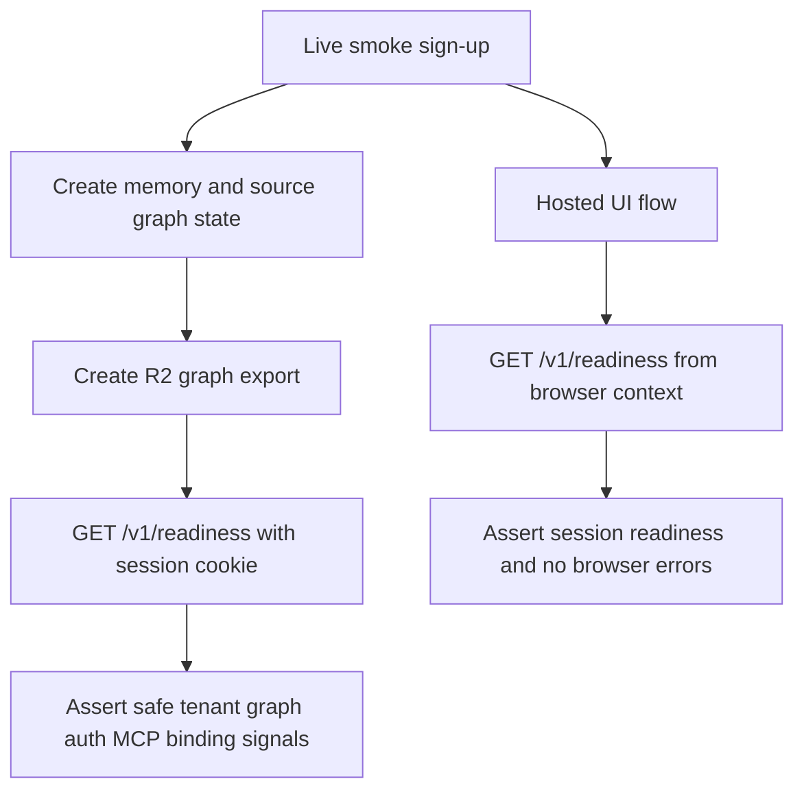

# feat: Live readiness smoke coverage

## Goal Capsule

- **Objective:** Make the production live-smoke gate prove the readiness surface across API and authenticated browser sessions, and keep release documentation aligned with that proof.
- **Authority:** User request for launch-ready backend confidence, all-layer tests, screenshots, and production verification; existing launch-readiness suite and live-smoke workflows.
- **Execution profile:** Small launch-hardening feature with behavior covered by opt-in live E2E and local type/check validation.
- **Stop conditions:** Stop if live readiness cannot be safely asserted without exposing secrets or mutating production data beyond the existing live-smoke test tenant.
- **Tail ownership:** This pass should open a PR and watch CI; live smoke should be manually dispatched after merge if CI does not run the scheduled workflow during the session.

---

## Product Contract

### Summary

OpenMemory now exposes `/v1/readiness`, but the live production smoke should explicitly assert that surface so a green live gate means the deployed system can report tenant graph, auth, MCP, binding, export, and rate-limit readiness.

### Problem Frame

The previous launch-readiness work added strong local coverage and UI screenshots. The remaining risk is evidence drift: production could pass older graph/MCP smoke checks while the new readiness endpoint silently regresses.

### Requirements

- R1. The live API E2E suite must call authenticated `/v1/readiness` after creating graph/export state and assert safe operational fields.
- R2. The live API E2E suite must verify readiness data is tenant-scoped and does not expose secrets, bearer tokens, or raw memory content.
- R3. The hosted UI browser smoke must verify the authenticated browser session can fetch readiness content without console or page errors.
- R4. Release and launch docs must state that live smoke covers readiness, not only auth, graph, OAuth, and MCP.
- R5. The change must preserve opt-in production smoke posture: live/provider checks remain gated behind `OPENMEMORY_LIVE_E2E=true` or the GitHub `Live Smoke` workflow.

### Acceptance Examples

- AE1. Given a live-smoke session with memories and an export, when `/v1/readiness` is requested with the session cookie, then the response includes the test tenant, graph totals above zero, MCP tool metadata, R2 export binding readiness, rate-limit settings, and no secret-like values.
- AE2. Given the hosted UI live-smoke account, when the browser opens the app after sign-up, then the authenticated browser context can request `/v1/readiness` and see session/MCP metadata without browser errors.

### Scope Boundaries

- This pass does not add new Cloudflare bindings, new dashboard sections, TanStack production mounting, or new production alert infrastructure.
- This pass does not make live smoke mandatory in normal PR CI; it remains scheduled/manual because it depends on production resources.
- Local screenshot generation remains in the existing ignored `.tmp/screenshots/launch-readiness/` path.

---

## Planning Contract

### Key Technical Decisions

- KTD1. **Use existing live tests instead of a new workflow.** The current `.github/workflows/live-smoke.yml` already runs API and UI live E2E against the deployed Worker, so adding assertions there keeps the gate simple and avoids duplicate production mutation/cleanup paths.
- KTD2. **Assert stable readiness semantics, not every binding detail.** Live tests should check fields that prove the endpoint shape, tenant scoping, graph state, MCP metadata, export readiness, and safety without becoming brittle to optional provider configuration.
- KTD3. **Keep docs honest about opt-in live coverage.** Release docs should identify readiness as part of live smoke while preserving the caveat that live smoke is production-resource dependent and not a default PR requirement.

### High-Level Technical Design

### Assumptions

- The deployed Worker is already updated from `main`, and the current live smoke result confirms the route is reachable.
- The readiness endpoint remains safe to call in production because it returns operational metadata, counts, booleans, and warnings rather than secrets or memory contents.

---

## Implementation Units

### U1. Live API readiness contract

- **Goal:** Extend the opt-in live API E2E to verify `/v1/readiness` after the live test has created meaningful tenant graph/export state.
- **Requirements:** R1, R2, R5, AE1.
- **Dependencies:** None.
- **Files:** `apps/api/test/live.e2e.test.ts`.
- **Approach:** Add a typed readiness response shape and call `authedJson` after graph stats and export assertions. Assert tenant identity source, graph counts, relationship catalog size, auth/MCP metadata, export binding, rate-limit values, and absence of known live-smoke memory/password/token strings.
- **Patterns to follow:** Existing `HealthResponse`, `GraphStatsResponse`, and local readiness assertions in `apps/api/test/http.integration.test.ts`.
- **Test scenarios:** Authenticated live session returns readiness for the same tenant; readiness graph counts reflect seeded state; readiness includes MCP tools and export/rate-limit metadata; serialized readiness omits password, bearer token, and seeded memory content.
- **Verification:** `OPENMEMORY_LIVE_E2E=true bun run --cwd apps/api test:live` passes against the deployed Worker; `bun run check` passes locally.

### U2. Hosted UI readiness smoke

- **Goal:** Make the hosted browser smoke prove readiness is reachable from the authenticated production browser session.
- **Requirements:** R3, R5, AE2.
- **Dependencies:** None.
- **Files:** `apps/api/e2e/live-ui.spec.ts`.
- **Approach:** After the existing recall/delete workflow, call `/v1/readiness` through Playwright's browser request context and assert session tenant/auth/MCP metadata. Preserve the existing console/page error collection.
- **Patterns to follow:** Local Playwright operations assertions in `apps/web/e2e/dashboard.spec.ts`.
- **Test scenarios:** Hosted dashboard signs up and keeps a session cookie; browser request context can fetch readiness; readiness reports session auth and MCP tools; no pageerror or console error fires while the dashboard is used.
- **Verification:** `OPENMEMORY_LIVE_E2E=true bun run test:e2e:ui` passes against the deployed Worker.

### U3. Release evidence documentation

- **Goal:** Update launch/release docs to describe readiness as part of live smoke evidence.
- **Requirements:** R4, R5.
- **Dependencies:** U1, U2.
- **Files:** `docs/release-qualification.md`, `docs/launch-readiness.md`, `docs/roadmap.md`.
- **Approach:** Make concise wording changes that reflect the new assertions without overstating broad SaaS readiness.
- **Patterns to follow:** Existing release qualification and launch readiness language around opt-in live gates.
- **Test scenarios:** Test expectation: none -- documentation-only unit, validated by review and normal formatting.
- **Verification:** A reader can see that live smoke covers readiness/operations and still understand it is an opt-in production-resource gate.

---

## Verification Contract

| Gate | Applies to | Done signal |
|---|---|---|
| `bun run check` | U1, U2, U3 | Type checks and tests for changed packages pass. |
| `OPENMEMORY_LIVE_E2E=true bun run --cwd apps/api test:live` | U1 | Live API smoke passes against deployed production URL. |
| `OPENMEMORY_LIVE_E2E=true bun run test:e2e:ui` | U2 | Hosted UI smoke passes and confirms browser-session readiness access. |
| GitHub CI | All units | PR checks pass. |
| GitHub Live Smoke workflow | All units | Manual/scheduled live smoke passes after merge or on the branch when dispatched. |

---

## Definition of Done

- U1 and U2 assertions are implemented without weakening existing live-smoke coverage.
- U3 docs are updated and do not imply live smoke is mandatory for every PR.
- Local validation for the changed code passes.
- CI is green on the PR.
- Any generated screenshots remain ignored local artifacts unless explicitly requested otherwise.
- Abandoned or exploratory code is removed before shipping.
