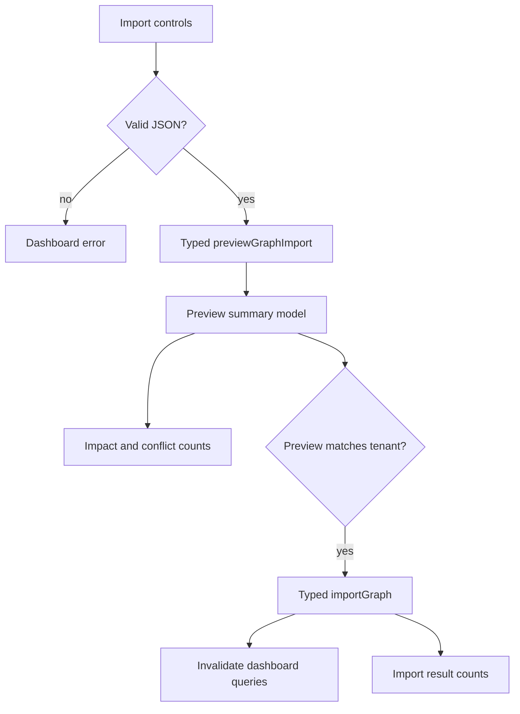

# Graph Import UI - Plan

## Goal Capsule

- **Objective:** Add a dashboard graph import workflow that lets an operator preview replace or merge imports, choose skip or overwrite for duplicate-memory conflicts, and apply the import only after an explicit preview.
- **Authority:** User request for a launch-ready backend-focused SaaS with polished shadcn/TanStack UI, existing graph import preview and conflict policy plans, and the current README roadmap gap.
- **Execution profile:** Standard software change with cross-layer behavior from typed client data to dashboard form state, model summaries, browser coverage, and documentation cleanup.
- **Stop conditions:** Stop if the existing import preview or import API contracts cannot support a safe UI without changing backend semantics, or if browser tests cannot exercise the graph dashboard state reliably.

---

## Product Contract

OpenMemory already supports graph export, import preview, merge, replace, and explicit duplicate-memory overwrite. The launch gap is that the hosted dashboard cannot inspect or execute that recovery flow, leaving operators to use raw API calls for a risky tenant data operation.

### Requirements

**Import workflow**

- R1. The graph dashboard must include a graph import panel with tenant confirmation, import mode, conflict policy, JSON payload entry, preview, and import actions.
- R2. The preview action must parse JSON locally, call the typed preview client, and surface a summary of impact counts, duplicate-memory changes, and field conflicts without rendering memory content.
- R3. The import action must use the same tenant, mode, conflict policy, and payload controls as the preview, invalidate dashboard data after success, and show the returned import counts.
- R4. Replace mode must stay visually distinct from merge mode because it can delete existing tenant graph data.

**Safety and polish**

- R5. Changing tenant, payload, mode, or conflict policy must clear the prior preview so stale decisions cannot be imported as if they still match the visible form.
- R6. Empty or invalid JSON payloads must fail client-side with the existing dashboard error surface rather than issuing a network request.
- R7. The UI must use existing shadcn-style local components and dashboard layout patterns instead of introducing a parallel control style.

**Verification and docs**

- R8. Unit tests must cover preview summary status and counts for waiting, skip, and overwrite decisions.
- R9. Browser tests must exercise the import panel with a valid payload and verify the preview state appears in the graph dashboard.
- R10. README or roadmap text must no longer claim graph import conflict preview UI is missing after this ships.

### Acceptance Examples

- AE1. Given a merge payload with changed duplicate memories and `skip`, when the user previews it, then the panel says changed duplicates will be skipped and shows skip counts.
- AE2. Given the same payload with `overwrite`, when the user previews it, then the panel says changed duplicates will be overwritten and exposes overwrite counts without showing memory content.
- AE3. Given a valid empty export payload, when the user enters the current tenant and previews it, then the graph page displays a ready merge preview and keeps the import action available for the matching tenant.
- AE4. Given an invalid JSON payload, when the user previews or imports, then no request is sent and the dashboard error surface says the payload must be valid JSON.

---

## Planning Contract

### Key Technical Decisions

- KTD1. Use the existing typed client import and preview methods from `@openmemory/client`; do not add web-only fetch logic. This preserves Eden Treaty-style typed boundaries across app surfaces.
- KTD2. Keep import preview presentation as a dashboard model helper in `apps/web/src/dashboard-model.ts`. The route should render state, while the helper owns tone, status copy, and count derivation.
- KTD3. Require a preview to be current with the visible tenant and clear previews on form changes. This is the minimum UI guardrail that keeps overwrite and replace decisions from being applied from stale form state.
- KTD4. Reuse existing local UI primitives (`Button`, `Input`, `Label`, `Select`, `Textarea`, `Badge`) and graph operations card styling. The dashboard should improve capability without introducing a new design language.

### High-Level Technical Design

### Scope Boundaries

- This plan does not change backend import semantics, graph data shape, D1 schema, Vectorize indexing, or the MCP import API.
- This plan does not add automatic semantic merge or field-by-field human resolution; it only exposes the existing skip and overwrite policies.
- This plan does not redesign the full dashboard shell; it adds a polished, functional import panel to the existing graph operations flow.

### System-Wide Impact

The change affects the dashboard’s highest-risk tenant graph recovery path. It must keep privacy posture by showing IDs, fields, and counts rather than raw imported memory content, and it must keep API parity by relying on the same typed client methods available to other app surfaces.

---

## Implementation Units

### U1. Preview Summary Model

- **Goal:** Add or complete a route-independent summary helper for graph import previews.
- **Requirements:** R2, R4, R8, AE1, AE2.
- **Dependencies:** None.
- **Files:** `apps/web/src/dashboard-model.ts`, `apps/web/src/dashboard-model.test.ts`.
- **Approach:** Derive status, tone, and counts from `GraphImportPreviewResult`, with distinct states for waiting, replace, merge-ready, skip conflicts, and overwrite conflicts.
- **Patterns to follow:** Existing dashboard model helpers and unit tests in `apps/web/src/dashboard-model.test.ts`.
- **Test scenarios:** Null preview returns zero counts and a neutral waiting state; merge skip with changed duplicates returns warn tone and skipped counts; merge overwrite with changed duplicates returns good tone and overwrite counts; replace mode returns danger tone.
- **Verification:** The model tests prove all import decision states without coupling to route rendering.

### U2. Dashboard Import Panel

- **Goal:** Render the graph import form, preview summary, conflict list, and import result state in the graph dashboard.
- **Requirements:** R1, R2, R3, R4, R5, R6, R7, AE1, AE2, AE3, AE4.
- **Dependencies:** U1.
- **Files:** `apps/web/src/routes/index.tsx`, `apps/web/src/styles/app.css`.
- **Approach:** Add local route state for tenant confirmation, mode, conflict policy, payload, latest preview, and latest import result. Wire mutations to `api.previewGraphImport` and `api.importGraph`, parse payloads before mutation, clear preview state on form changes, and keep import disabled until a preview matches the visible tenant.
- **Patterns to follow:** Existing `GraphOperationsPanel`, mutation error handling, `invalidateDashboard`, and local shadcn component usage in `apps/web/src/routes/index.tsx`.
- **Test scenarios:** Valid payload preview renders summary counts; changing form controls clears stale preview; invalid JSON sets dashboard error and does not call mutation; import success invalidates dashboard queries and renders returned counts.
- **Verification:** Type-checking passes, and browser tests can locate and exercise the import panel.

### U3. Browser and Documentation Coverage

- **Goal:** Prove the import UI in the app shell and remove stale launch-readiness wording.
- **Requirements:** R9, R10, AE3.
- **Dependencies:** U2.
- **Files:** `apps/web/e2e/dashboard.spec.ts`, `README.md`.
- **Approach:** Extend the graph dashboard E2E flow to fill tenant confirmation and a minimal graph export payload, trigger preview, and assert the panel transitions into a ready preview state. Update README roadmap language to reflect that backend and UI import preview/overwrite support exist.
- **Patterns to follow:** Existing dashboard E2E screenshots and README launch-readiness sections.
- **Test scenarios:** Browser flow sees graph import preview panel; valid empty export payload previews successfully; screenshots capture the graph dashboard with import controls.
- **Verification:** Local E2E completes with refreshed screenshots and README no longer lists this feature as missing.

---

## Verification Contract

| Gate | Proves | Units |
|---|---|---|
| `bun --cwd apps/web test` | Dashboard model helper behavior and route-adjacent UI helpers stay correct. | U1, U2 |
| `bun run test:e2e:local` | The dashboard shell can exercise the graph import preview flow and refresh screenshots. | U2, U3 |
| `bun run check` | Workspace formatting, linting, type-checking, and test gates remain green. | U1, U2, U3 |
| `bun run build` | Production TanStack/Vite output still builds for Cloudflare deployment. | U2, U3 |

---

## Definition of Done

- U1 is complete when preview summary tests cover waiting, skip, overwrite, and replace states.
- U2 is complete when the graph dashboard exposes preview and import actions using typed client methods, clears stale preview state on control changes, and shows impact/conflict/result counts without memory content.
- U3 is complete when E2E tests exercise the import panel, screenshots are refreshed, and stale roadmap wording is removed.
- The branch is complete when code is formatted, tests and build pass locally, changes are committed with gitmoji, pushed to GitHub, a PR is opened, and CI is driven to a decided green state or any residual is made durable.
