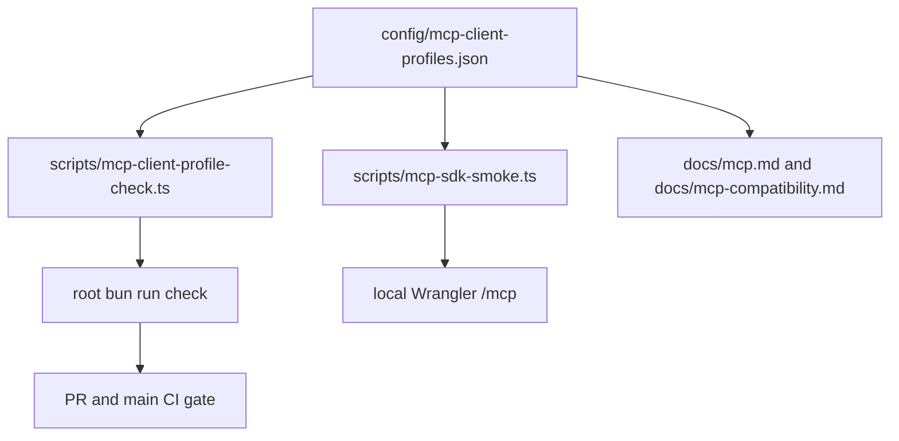

# feat: Check MCP client profile artifacts

## Goal Capsule

- **Objective:** Turn named MCP client compatibility claims into a checked repo artifact that local, CI, and live-readiness workflows can reuse.
- **Authority hierarchy:** User request for launch readiness and MCP confidence, existing MCP compatibility docs, then current repo scripts and Cloudflare-native constraints.
- **Execution profile:** Standard production-readiness slice with documentation, script coverage, MCP smoke coverage, and full repo checks.
- **Stop conditions:** Stop if the shared profile artifact cannot represent every documented MCP client shape, if the SDK smoke cannot consume the artifact, or if the checker cannot run inside the root `bun run check` gate.
- **Tail ownership:** Open a PR, drive checks green, merge if clean, then run live validation that is proportional to this slice.

---

## Product Contract

OpenMemory already exposes MCP over streamable HTTP at `/mcp`, with OAuth in production and a development tenant header path for local CI. The launch gap is that external client compatibility claims are described in prose, while only the official TypeScript SDK smoke is executable. This plan makes the named client matrix a first-class artifact and ensures docs, expected tools, scopes, and smoke-test request profiles stay synchronized.

### Requirements

- R1. The repo must include a canonical MCP client profile artifact that names the supported request profiles, transport, production endpoint, OAuth metadata paths, required scopes, and expected tools.
- R2. The official MCP SDK smoke must consume the shared profile artifact instead of maintaining its own hardcoded profile list.
- R3. Root quality gates must fail when the profile artifact, MCP docs, OAuth scopes, expected tools, or minimum executable coverage drift.
- R4. MCP compatibility docs must point developers to the checked artifact and the command that validates it.
- R5. The implementation must not introduce feature flags, skipped assertions, mocked protocol behavior, or local-only claims that appear stronger than the actual dogfooding evidence.

### Scope Boundaries

- Real external OAuth callback testing in Cursor, Claude, ChatGPT, or MCP Inspector remains a manual/live follow-up because those products require provider-side UI configuration and accounts.
- This slice does not split MCP into a separate Cloudflare Agent Worker; the current monolithic API Worker remains valid unless session-specific MCP state or scaling needs appear.
- This slice does not change MCP tool semantics, Better Auth behavior, D1 schema, Vectorize behavior, or frontend UI.

### Acceptance Examples

- AE1. Given a maintainer changes the expected MCP tool list in the profile artifact but not the docs, when `bun run check` runs, then the profile checker fails with a clear sync error.
- AE2. Given `bun run test:mcp:sdk` starts local Wrangler, when it loads request profiles, then it tests the official SDK profile and the documented client-shape profiles against `/mcp`.
- AE3. Given a developer reads the MCP compatibility matrix, when they need client configuration, then they can find `config/mcp-client-profiles.json` and `bun run mcp:profiles:check`.

---

## Planning Contract

### Key Technical Decisions

- KTD1. Store MCP request profiles as JSON rather than TypeScript. JSON is easier for docs, client snippets, future CI consumers, and non-TypeScript tooling to read without importing app code.
- KTD2. Make the profile checker part of root `bun run check`. This catches drift before PR merge and before Cloudflare deploys, matching the existing quality-gate style used for secret scanning and type/test checks.
- KTD3. Reuse the official MCP SDK transport for all config-shape profiles. The profiles are not claiming full product-specific OAuth UI dogfooding; they prove streamable HTTP handshake, headers, tool listing, and tool calls under each named request shape.
- KTD4. Keep evidence labels explicit: one profile is `tested-in-ci`; product-specific clients are `config-shape-smoke`. This avoids overstating launch confidence while still making the compatibility matrix executable.

### High-Level Technical Design

### Assumptions

- The checked client profiles should use the current production API origin `https://openmemory-api.abbierman101.workers.dev`.
- The required MCP tool list remains `remember`, `recall`, `profile`, and `forget`.
- `openid`, `profile`, `memory:read`, and `memory:write` are the current minimum OAuth scopes for production MCP clients.

---

## Implementation Units

### U1. Add Shared MCP Client Profile Artifact

- **Goal:** Create the canonical profile config with production endpoint, OAuth metadata paths, scopes, transport, request profile IDs, user agents, and expected tools.
- **Requirements:** R1, R5
- **Dependencies:** None
- **Files:** `config/mcp-client-profiles.json`
- **Approach:** Keep the artifact declarative and client-neutral. Represent status labels honestly so CI-tested SDK coverage is distinct from config-shape smoke coverage.
- **Patterns to follow:** Existing repo-level config artifacts under `config/` or `scripts/` inputs; plain JSON for tooling interoperability.
- **Test scenarios:** Checker rejects missing base URL, invalid paths, duplicate IDs, non-kebab IDs, missing scopes, missing expected tools, and profiles without status/user agent metadata.
- **Verification:** The profile checker reports every configured profile and no schema or sync failures.

### U2. Add Profile Consistency Checker

- **Goal:** Add an executable validator that checks the profile artifact and verifies MCP docs reference each profile.
- **Requirements:** R3, R4, AE1, AE3
- **Dependencies:** U1
- **Files:** `scripts/mcp-client-profile-check.ts`, `package.json`
- **Approach:** Validate the JSON shape directly in a Bun script, check required OAuth scopes and expected tools, enforce at least one `tested-in-ci` profile, and wire the command into root `bun run check`.
- **Patterns to follow:** Existing root validation scripts such as `scripts/secret-scan.ts` and `scripts/benchmark-trend-report.ts`.
- **Test scenarios:** The checker succeeds against the committed artifact; manual or fixture-negative cases should be easy to diagnose through exact error messages. Root `bun run check` must execute the checker before Biome and Turbo gates.
- **Verification:** `bun run mcp:profiles:check` and `bun run check` both pass.

### U3. Reuse Profiles in MCP SDK Smoke

- **Goal:** Replace hardcoded MCP smoke profiles with profiles loaded from the shared artifact.
- **Requirements:** R2, R5, AE2
- **Dependencies:** U1
- **Files:** `scripts/mcp-sdk-smoke.ts`
- **Approach:** Load the JSON artifact at runtime, validate minimal smoke-needed fields, construct tenant IDs and user agents from each profile, and assert every configured expected tool exists.
- **Patterns to follow:** Current `scripts/mcp-sdk-smoke.ts` local Wrangler lifecycle and official `@modelcontextprotocol/sdk` `StreamableHTTPClientTransport` usage.
- **Test scenarios:** `bun run test:mcp:sdk` starts local Wrangler, loads all profiles, lists tools, calls `remember`, calls `recall`, and cleans up the local server process.
- **Verification:** MCP SDK smoke passes locally and in CI with all profiles included.

### U4. Update MCP Documentation

- **Goal:** Document that MCP client compatibility is backed by the shared artifact and checker.
- **Requirements:** R4, R5, AE3
- **Dependencies:** U1, U2, U3
- **Files:** `docs/mcp.md`, `docs/mcp-compatibility.md`
- **Approach:** Link to `config/mcp-client-profiles.json`, add `bun run mcp:profiles:check`, and preserve the distinction between CI-tested SDK coverage and config-shape smoke coverage.
- **Patterns to follow:** Existing compatibility matrix style and Cloudflare/MCP docs in `docs/`.
- **Test scenarios:** The checker must find every profile ID or label in `docs/mcp-compatibility.md`; docs must not imply manual external OAuth dogfooding has already happened.
- **Verification:** Documentation review confirms the matrix, known gaps, and command references are consistent.

---

## Verification Contract

| Gate | Applies to | Done signal |
| --- | --- | --- |
| `bun run format` | U1-U4 | Biome writes no further changes after the formatting pass. |
| `bun run mcp:profiles:check` | U1, U2, U4 | All profiles, scopes, tools, and docs references validate. |
| `bun run test:mcp:sdk` | U1, U3 | Local Wrangler starts, all profiles complete initialize/tools/list/tool calls, and the process exits cleanly. |
| `bun run check` | U1-U4 | Secret scan, profile check, Biome, types, and tests pass. |
| `bun run build` | U1-U4 | Monorepo production build still passes. |
| PR CI and targeted live smoke | U1-U4 | GitHub checks pass; live smoke confirms production Worker health after merge if deployment changes are produced. |

---

## Definition of Done

- `config/mcp-client-profiles.json` is committed and represents every named MCP compatibility profile in the docs.
- `scripts/mcp-sdk-smoke.ts` reads the shared artifact and exercises every profile.
- `scripts/mcp-client-profile-check.ts` is wired into root `bun run check`.
- MCP docs link the artifact and checker without overstating external-client OAuth coverage.
- Formatting, profile check, MCP SDK smoke, root check, build, PR CI, and proportional live validation pass.
- The branch contains no abandoned experimental files, skipped assertions, feature flags, or unrelated cleanup.
