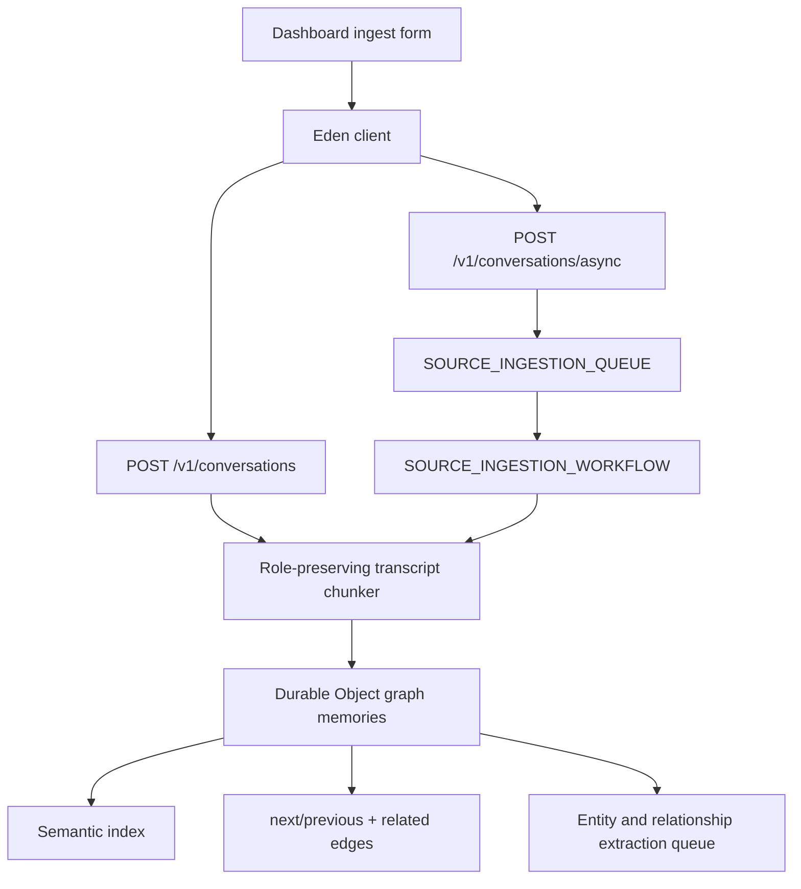

# feat: Add conversation transcript ingestion

## Direction

Make OpenMemory ingest AI chat transcripts as first-class memory sources so users can preserve the context, roles, ordering, and provenance of conversations across AI tools.

This closes a core product gap between generic document ingestion and the original cross-chat memory goal: conversations need durable `conversationId` identity, role-preserving chunks, graph edges, recall, UI entry points, and async queue/workflow parity.

## Settled Decisions

- Decision: Keep OpenMemory Cloudflare-native.
  - Provenance: user-directed.
  - Rejected alternative: moving ingestion, graph, RAG, or queue runtime off Cloudflare.
  - Reason: the product thesis is an open-source Cloudflare-native memory stack.
- Decision: Use Elysia and Eden Treaty for the API and typed clients.
  - Provenance: user-directed.
  - Rejected alternative: switching the HTTP/RPC surface to Hono-only patterns.
  - Reason: the user prefers Elysia's RPC shape and the repo already exposes Eden client helpers.
- Decision: Preserve Drizzle, Better Auth, Bun, TypeScript, Turborepo, TanStack, shadcn-style UI, Vitest, and Playwright.
  - Provenance: user-directed.
  - Rejected alternative: replacing the current launch stack during this pass.
  - Reason: these are the established project conventions and the user's stated preferences.
- Decision: Avoid launch flags for required production behavior.
  - Provenance: user-directed.
  - Rejected alternative: hiding transcript ingestion behind a feature switch.
  - Reason: the user asked for clean, consistent production code rather than flagged partial paths.

Standing report-conflicts line: if a settled decision blocks correctness or launch safety, stop and report the conflict instead of silently working around it.

## Requirements

- R1. Add a shared transcript ingestion contract with bounded message counts, role validation, durable `conversationId`, transcript metadata, and chunking controls.
- R2. Add sync and async API endpoints for conversation ingestion that reuse the Cloudflare-native source ingestion pipeline, queue, workflow, graph, extraction, and search infrastructure.
- R3. Preserve role order, message ranges, timestamps, transcript title, source id, and conversation id on created memory chunks.
- R4. Link transcript chunks to each other and to related graph memories so recall and graph traversal work for chat-derived memories.
- R5. Expose typed Eden client helpers for transcript ingestion so the web app and MCP-adjacent clients can call the same contract.
- R6. Add a web dashboard ingestion mode for conversations without removing document ingestion.
- R7. Update launch, data-model, roadmap, and release docs to describe transcript ingestion accurately.
- R8. Verify the feature through the testing trophy shape: schema/client unit tests, API integration tests, browser E2E, full check/build, and cached Docker integration.

## Acceptance Evidence

- AE1. Core schema tests accept valid transcript payloads and reject contract drift.
- AE2. Eden client tests call `POST /v1/conversations` with the typed request shape.
- AE3. API integration tests prove sync transcript ingestion preserves turns, metadata, graph links, and recall.
- AE4. API integration tests prove async transcript ingestion creates a durable queue/workflow job and indexes searchable memories.
- AE5. Browser E2E proves the dashboard defaults to conversation ingestion and submits through the conversation API.
- AE6. Live E2E coverage includes hosted transcript ingestion when live credentials are available.
- AE7. `bun run check`, `bun run build`, and cached Docker integration pass before shipping.

## Planning Contract

### High-Level Technical Design

- KTD1. Conversation ingestion extends source ingestion instead of creating a parallel runtime. This keeps chunk indexing, graph relationship writes, extraction queueing, async job state, and failure behavior aligned with existing source ingestion.
- KTD2. Transcript chunks are episode memories with explicit `conversationId` and range metadata. This makes chat context queryable by semantic recall while keeping reconstruction and debugging possible.
- KTD3. Async messages use a discriminated `kind` field while preserving backward compatibility for existing source queue payloads. Queue consumers can route new transcript jobs without breaking older source messages.
- KTD4. The web app defaults new ingestion to conversation mode because cross-chat memory is the primary product promise, while document mode remains available in the same flow.

## Implementation Units

### U1. Shared Transcript Contract

- **Goal:** Add core schema and client types for transcript ingestion.
- **Requirements:** R1, R5.
- **Files:** `packages/core/src/index.ts`, `packages/core/src/index.test.ts`, `packages/client/src/index.ts`, `packages/client/src/index.test.ts`.
- **Approach:** Add bounded conversation/message schemas, export typed inputs, and expose an Eden helper that posts to the new conversation endpoint.
- **Patterns to follow:** Existing source ingestion schema and client helper patterns.
- **Test scenarios:** Valid transcript payloads parse with defaults; invalid role/message bounds fail; client helper serializes the typed request to `/v1/conversations`.
- **Verification:** Core and client package tests pass.

### U2. API and Pipeline Ingestion

- **Goal:** Implement sync and async transcript ingestion through the current Cloudflare-native graph/RAG pipeline.
- **Requirements:** R2, R3, R4.
- **Files:** `apps/api/src/index.ts`, `apps/api/src/env.ts`, `apps/api/src/source-ingestion.ts`, `apps/api/test/http.integration.test.ts`, `apps/api/test/live.e2e.test.ts`.
- **Approach:** Add conversation routes, chunk role-preserving messages, store chunk metadata, create next/previous chunk edges, link related graph memories, index semantic vectors, enqueue extraction, and route queue/workflow messages by `kind`.
- **Patterns to follow:** Existing `/v1/sources`, `/v1/sources/async`, ingestion job ledger, graph relation writer, and integration test helpers.
- **Test scenarios:** Sync ingestion preserves role lines, `conversationId`, source metadata, graph links, and search results; async ingestion creates a durable job and searchable chunk; live E2E exercises hosted transcript ingestion when configured.
- **Verification:** API integration and live-test compile/skipped-mode paths pass.

### U3. Dashboard Conversation Mode

- **Goal:** Let users ingest role-prefixed AI chat transcripts from the web app.
- **Requirements:** R5, R6.
- **Files:** `apps/web/src/routes/index.tsx`, `apps/web/e2e/dashboard.spec.ts`.
- **Approach:** Add conversation/document mode selection, conversation id input, transcript line parsing, and submit routing to the typed client.
- **Patterns to follow:** Existing dashboard mutation, status panel, and Playwright screenshot flow.
- **Test scenarios:** Dashboard defaults to conversation mode, generates a conversation id, submits transcript content, and still keeps document mode selectable.
- **Verification:** Local browser E2E passes and screenshots are refreshed.

### U4. Documentation and Launch Evidence

- **Goal:** Make the public docs and launch checklist reflect the new transcript capability.
- **Requirements:** R7, R8.
- **Files:** `README.md`, `docs/data-model.md`, `docs/launch-readiness.md`, `docs/release-qualification.md`, `docs/roadmap.md`.
- **Approach:** Document sync/async transcript endpoints, memory metadata, queue message shape, launch evidence, and the remaining roadmap shift from raw transcript ingestion to productized imports for specific AI chat surfaces.
- **Patterns to follow:** Existing launch-readiness and roadmap evidence language.
- **Test scenarios:** Documentation references implemented endpoints and does not overclaim vendor-specific chat imports.
- **Verification:** Full repo checks pass with docs included in the branch diff.

## Verification Contract

| Gate | Covers | Done signal |
|---|---|---|
| Core/client unit tests | U1 | Transcript schemas and Eden helper pass focused tests. |
| API integration tests | U2 | Sync and async transcript ingestion create memories, metadata, graph links, jobs, and recall results. |
| Browser E2E | U3 | Dashboard conversation ingest path is exercised with explicit state assertions. |
| Full check/build | U1-U4 | Type checks, tests, lint/format, docs checks, and production bundle build pass. |
| Cached Docker integration | U2 | Wrangler-style integration path passes inside the cached Docker image. |

## Definition of Done

- Transcript ingestion is available through sync API, async API, typed client, and dashboard UI.
- Created memories preserve role order, message ranges, metadata, tags, `sourceId`, and `conversationId`.
- Graph and RAG behavior works for transcript chunks through semantic index, related edges, and chunk-order edges.
- Existing source ingestion remains backward compatible.
- Docs and launch evidence describe what is shipped and what remains manual or future work.
- No experimental or dead-end code remains in the diff.
- All verification gates listed above pass before PR merge.

## Scope Boundaries

- Deferred to follow-up work: productized importers for ChatGPT, Claude, Cursor, or other vendor-specific export formats.
- Deferred to follow-up work: richer transcript reconstruction UI from chunk metadata.
- Out of scope: moving graph/RAG runtime off Cloudflare.
- Out of scope: adding feature flags for transcript ingestion.
