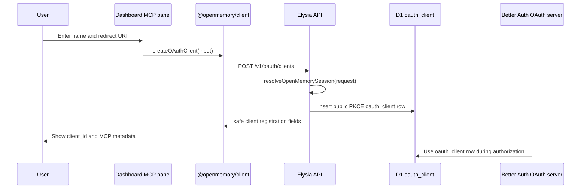

# feat: Add MCP OAuth client management

## Goal Capsule

| Field | Value |
|---|---|
| Objective | Let authenticated users create, inspect, and disable first-party OAuth client registrations for MCP from the dashboard. |
| Authority | User request for production launch readiness, Cloudflare-native stack, Better Auth OAuth, Eden Treaty client parity, and robust testing. |
| Execution profile | Standard cross-layer feature across API, client, dashboard UI, docs, and integration tests. |
| Stop conditions | Stop if direct Better Auth OAuth client rows are incompatible with the OAuth server schema, or if ownership cannot be enforced with the existing session resolver. |

---

## Product Contract

### Summary

OpenMemory already exposes Better Auth OAuth metadata, dynamic registration, and grant revocation.
The dashboard should now provide a safer first-party management path for MCP clients so users do not have to manually call unauthenticated dynamic registration endpoints or lose track of registered clients.

### Problem Frame

The launch roadmap still has MCP vendor dogfooding and OAuth lifecycle gaps.
Existing code supports authorized-client grants under `/v1/oauth/connections`, but not user-owned client registrations.
That leaves setup split between metadata snippets and external registration calls.

### Requirements

- R1. Authenticated users can create a public PKCE OAuth client registration for MCP with a name and one or more redirect URIs.
- R2. Authenticated users can list only their own OAuth client registrations with safe fields: client ID, name, redirect URIs, scopes, auth method, public/PKCE/disabled state, and timestamps.
- R3. Authenticated users can disable their own OAuth client registration and revoke its outstanding tokens/consents.
- R4. The API rejects unauthenticated management requests and invalid redirect URI payloads.
- R5. The Eden client exposes typed helpers for the management routes.
- R6. The dashboard MCP panel shows setup metadata, registered clients, creation controls, disabled state, and authorized grant revocation without exposing client secrets.
- R7. Documentation explains dashboard registration as the preferred first-party MCP setup path while keeping dynamic registration metadata available for standards-compatible clients.

### Scope Boundaries

- In scope: first-party public OAuth client management for MCP.
- In scope: disabling/deleting owned registrations and revoking related tokens/consents.
- Deferred to follow-up work: manual full OAuth callback dogfooding in Cursor, Claude, ChatGPT, and MCP Inspector.
- Deferred to follow-up work: hosted GitHub/Google social login secret provisioning.
- Outside this slice: replacing Better Auth OAuth, adding confidential-client secret issuance, or creating a separate admin portal.

---

## Planning Contract

### Key Technical Decisions

- KTD1. Use Drizzle against the existing `oauth_client` table rather than adding a parallel table. This preserves Better Auth compatibility and keeps client registration visible to the OAuth server.
- KTD2. Create public PKCE clients only. MCP desktop/browser integrations should not require stored client secrets, and the schema already supports `public` and `require_pkce`.
- KTD3. Treat disable as the user-facing delete operation. The row remains auditable, while access tokens, refresh tokens, and consents for that client are removed.
- KTD4. Require a real Better Auth session for client management. Local development tenant headers remain useful for memory APIs, but persistent OAuth clients should be owned by authenticated users.
- KTD5. Extend the existing MCP dashboard panel instead of introducing a new settings surface. MCP setup, registrations, and authorized grants are one user flow.

### High-Level Technical Design

### Assumptions

- Better Auth accepts JSON-serialized `redirect_uris`, `grant_types`, `response_types`, and space-delimited or JSON-compatible scopes as currently used by the repository tests.
- The existing `resolveOpenMemorySession` helper is the correct ownership boundary for dashboard OAuth lifecycle actions.

---

## Implementation Units

### U1. API OAuth Client Management

- **Goal:** Add authenticated create/list/disable routes for user-owned OAuth clients.
- **Requirements:** R1, R2, R3, R4; KTD1, KTD2, KTD3, KTD4.
- **Dependencies:** None.
- **Files:** `apps/api/src/oauth-connections.ts`, `apps/api/src/index.ts`, `apps/api/test/http.integration.test.ts`.
- **Approach:** Extend the existing OAuth lifecycle module with safe serializers, redirect URI validation, client ID generation, ownership checks, and disable-plus-revoke semantics.
- **Patterns to follow:** Existing `listOAuthConnections` and `revokeOAuthConnection` session handling, Drizzle D1 usage in `apps/api/src/oauth-connections.ts`, OAuth flow tests in `apps/api/test/http.integration.test.ts`.
- **Test scenarios:** Authenticated POST creates a public PKCE client and returns no secret; unauthenticated POST/GET/DELETE returns 401; invalid redirect URIs return 400; GET returns only the session user's clients; DELETE disables the row and removes related tokens/consents; deleting an unknown or other-user client returns 404.
- **Verification:** API integration tests prove route contracts against local Wrangler/D1.

### U2. Eden Client Helpers

- **Goal:** Expose typed helpers for OAuth client management.
- **Requirements:** R5.
- **Dependencies:** U1.
- **Files:** `packages/client/src/index.ts`, client package tests if present.
- **Approach:** Add `OAuthClientRegistration` and `CreateOAuthClientInput` types, plus `listOAuthClients`, `createOAuthClient`, and `deleteOAuthClient` helpers beside the existing connection helpers.
- **Patterns to follow:** Existing Eden Treaty wrapper and `unwrap` handling in `packages/client/src/index.ts`.
- **Test scenarios:** Client helper sends POST body through Eden; delete helper uses the client ID path; exported types cover safe response shape without `clientSecret`.
- **Verification:** Typecheck and client tests pass.

### U3. Dashboard MCP Panel

- **Goal:** Make MCP registration management visible and usable in the dashboard.
- **Requirements:** R1, R2, R3, R6.
- **Dependencies:** U1, U2.
- **Files:** `apps/web/src/routes/index.tsx`, `apps/web/src/dashboard-model.test.ts`, `apps/web/e2e/dashboard.spec.ts` if browser assertions need expanding.
- **Approach:** Add a query for registered OAuth clients, a create mutation with optimistic query invalidation, a disable mutation, and a compact registered-clients section in `McpSetup`.
- **Patterns to follow:** Existing React Query setup, current OAuth connection revocation mutation, shadcn-flavored inputs/buttons already used by the dashboard.
- **Test scenarios:** Empty state shows registration form; populated state renders client ID and redirect URIs; create mutation invalidates OAuth clients; disable mutation invalidates clients and connections; existing grant revocation remains available.
- **Verification:** Web typecheck, model tests, and local E2E screenshot pass.

### U4. Documentation and Launch Evidence

- **Goal:** Update launch docs so the preferred MCP setup path matches the product.
- **Requirements:** R7.
- **Dependencies:** U1, U2, U3.
- **Files:** `docs/mcp-compatibility.md`, `docs/roadmap.md`, `README.md`.
- **Approach:** Describe dashboard-created public PKCE registrations, clarify dynamic registration remains standards metadata, and adjust the roadmap gap from "lifecycle UI" to remaining vendor dogfooding.
- **Patterns to follow:** Existing launch evidence and roadmap wording.
- **Test scenarios:** Test expectation: none -- documentation-only.
- **Verification:** Markdown review by inspection and launch evidence check if docs touch launch status.

---

## Verification Contract

| Gate | Scope | Done Signal |
|---|---|---|
| API integration | U1 | OAuth client management tests pass against local Wrangler/D1. |
| Client/type checks | U2 | `@openmemory/client` exports compile and helper tests pass. |
| Web checks | U3 | Dashboard tests and typecheck pass with no React Query regressions. |
| Full repo quality | U1-U4 | `bun run check`, `bun run build`, relevant integration tests, and browser screenshots complete. |
| Shipping | U1-U4 | Branch is committed with gitmoji, pushed, opened as PR, and CI is watched to green. |

---

## Definition of Done

- Users can create, list, and disable first-party MCP OAuth clients from the dashboard.
- Client secrets are never returned by first-party management routes.
- Disabled clients cannot remain authorized through existing tokens or consents.
- API, client, web, and integration tests cover happy paths and failure paths.
- MCP docs and roadmap match the implemented lifecycle.
- Browser screenshots of the MCP panel are captured and shared with the user.
- Abandoned exploratory code, generated artifacts, and temporary files are removed or ignored before shipping.
